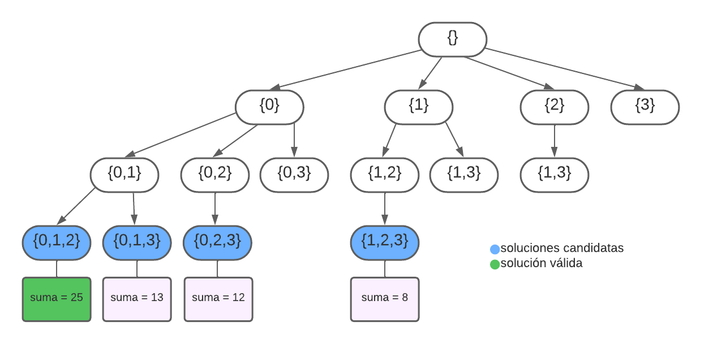
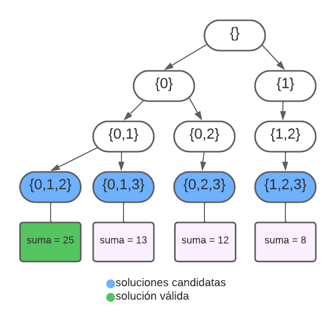
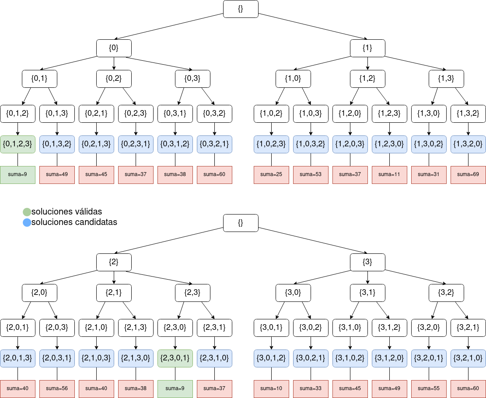
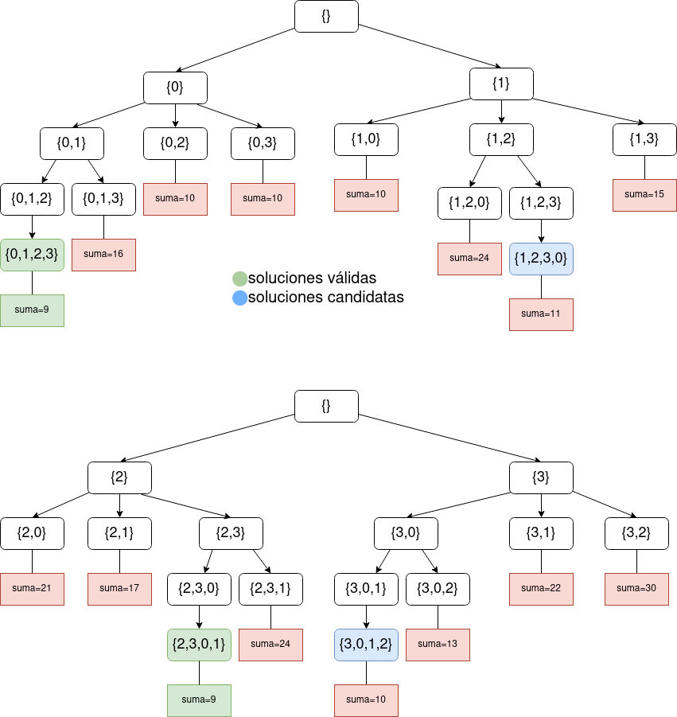

# Práctica 1: Técnicas Algorítmicas

## Backtracking

### Ejercicio 1

**a)** Soluciones candidatas para C = {6, 12, 6}, k = 12: 

{0,0,0},{1,0,0},{1,1,0},{1,1,1},{1,0,1},{0,1,0},{0,1,1},{0,0,1}

**b)** Soluciones válidas para C = {6, 12, 6}, k = 12: 

{1,0,1},{0,1,0}

**c)** Soluciones parciales para C = {6, 12, 6} y k = 12:

{},{0},{1},{0,0},{0,1},{1,0},{1,1},{0,0,0},{0,0,1},{0,1,0},{0,1,1},{1,0,0},{1,0,1}

**d)**


**g)**


**h)**


Posible implementación en C++:
```cpp
bool subset_sum(vector<int> C, int i, int j){
    if(j<0) return false; // regla de factibilidad
    if(j==0) return true; // existe sub_set que cumple
    if (i == 0) {
        return j == 0;
    } else {
        return subset_sum(C, i-1, j) or subset_sum(C, i-1, j-C[i-1]);
    }
}
```

**i)** otra regla de factibilidad sería que el algoritmo te de true cuando j = 0.

**j)** Posible implementación en C++

```cpp
bool subset_suma_aux(const vector<int>& C, int i, int j, vector<int>& p) {
    if (j < 0) return false; // Regla de factibilidad
    if (j == 0) {
        // Imprime el subconjunto actual almacenado en el vector p
        for (int num : p) {
            cout << num << " ";
        }
        cout << endl;
        return true;
    }
    if (i == 0) return false;

    // Prueba incluir el elemento actual en el subconjunto
    p.push_back(C[i - 1]);
    bool incluido = subset_suma_aux(C, i - 1, j - C[i - 1], p);
    p.pop_back(); // Elimina el último elemento del vector p

    // Prueba no incluir el elemento actual en el subconjunto
    bool no_incluido = subset_suma_aux(C, i - 1, j, p);

    return incluido || no_incluido;
}

void subset_suma(const vector<int>& C, int k) {
    vector<int> p; // Vector para mantener el subconjunto actual
    bool result = subset_suma_aux(C, C.size(), k, p);

    if (!result) {
        cout << "No se encontró ningún subconjunto que sume " << k << endl;
    }
}
```

Se puede probar con el siguiente main:

```cpp
int main() {
    std::vector<int> C = {6, 12, 6};
    int targetSum = 12;

    subset_suma(C, targetSum);

    return 0;
}
```

### Ejercicio 2

**a)** Al ser cuadrados mágicos de orden n quiere decir que se tienen n² casillas, entonces al usar fuerza bruta se tendrían que generar (n²)! cuadrados mágicos.

**b)** El arbol de backtracking por fuerza bruta sería de este estilo:


Una posible implementación sería la siguiente:
```cpp
// variables globales
const int N = 3; // aqui se elije el tamaño del cuadrado
int cuadrado[N][N] = {}; // esta sería la matriz con la que se inicia el algoritmo
int numero_magico = (pow(N,3)+N)/2;
int contador = 0; // contador de cuadrados mágicos encontrados
bool usados[N*N+1] = {false};

bool esMagico(){
    // inicializo variables locales que usaré
    int sum_fila=0;
    int sum_col=0;
    int sum_diag1=0;
    int sum_diag2=0;
    bool num_utilizados[N*N+1] = {false}; // arreglo booleano para rastrear números utilizados

    // verifico que las filas sumen el número mágico
    for(int i=0;i<N;i++){
        sum_fila=0;
        for(int j=0;j<N;j++){
            // me fijo que el número esté en rango
            int num = cuadrado[i][j];
            if(num<1 || num>N*N){
                return false;
            }
            sum_fila += cuadrado[i][j];
            num_utilizados[num] = true;
        }
        if(numero_magico != sum_fila) return false;
    }

    // verifico que las columnas sumen el número mágico
    for(int j=0;j<N;j++){
        sum_col=0;
        for(int i=0;i<N;i++){
            sum_col += cuadrado[i][j];
        }
        if(numero_magico != sum_col) return false;
    }

    // verifico ahora las diagonales
    for(int i=0;i<N;i++){ // diagonal 1
        sum_diag1 += cuadrado[i][i];
    }
    if(numero_magico != sum_diag1) return false;

    for(int i=N-1;i>=0;i--){
        sum_diag2 += cuadrado[i][N-1-i];
    }
    if(numero_magico != sum_diag2) return false;

    // verifico que realmente se utilizan los números correspondientes
    for(int num = 1; num <= N*N; num++) {
        if (!num_utilizados[num]) // Un número no se utilizó
            return false;
    }

    // finalmente, si el algoritmo llega hasta aquí es porque sí es cuadrado mágico
    return true;
}

void square_generator(int i, int j){
    if(i==N){ // si i=N-1 es porque se acabaron las filas
        if(esMagico()){
            contador++;
        }
        return;
    }

    int sigI = i, sigJ = j + 1;
    if (sigJ == N) {
        sigI = i + 1;
        sigJ = 0;
    }

    for (int num = 1; num <= N*N; num++) {
        if (!usados[num]) {
            cuadrado[i][j] = num;
            usados[num] = true;
            square_generator(sigI, sigJ);
            cuadrado[i][j] = 0;
            usados[num] = false;
        }
    }
    // reinicio num_utilizados para la siguiente iteración
    for (int num = 1; num <= N*N; num++) {
        usados[num] = false;
    }
}

int main() {
    // generar cuadrados
    square_generator(0, 0);

    // Imprimir el resultado
    cout << "Número de cuadrados mágicos de orden " << N << ": " << contador << endl;

    return 0;
}
```

**d)** La poda mejora un poco la eficiencia del algoritmo pero sigue siendo malo para números altos.
```cpp
void square_generator(int i, int j, int sum_filas[], int sum_columnas[]) {
    if (i == N) {
        if (esMagico()) {
            contador++;
        }
        return;
    }

    int sigI = i, sigJ = j + 1;
    if (sigJ == N) {
        sigI = i + 1;
        sigJ = 0;
    }

    for (int num = 1; num <= N * N; num++) {
        if (!usados[num] && sum_filas[i] + num <= numero_magico && sum_columnas[j] + num <= numero_magico) {
            cuadrado[i][j] = num;
            usados[num] = true;
            sum_filas[i] += num;
            sum_columnas[j] += num;
            square_generator(sigI, sigJ, sum_filas, sum_columnas);
            cuadrado[i][j] = 0;
            usados[num] = false;
            sum_filas[i] -= num;
            sum_columnas[j] -= num;
        }
    }
}

int main() {
    int sum_filas[N] = {0}; // suma parcial de cada fila
    int sum_columnas[N] = {0}; // suma parcial de cada columna

    square_generator(0, 0, sum_filas, sum_columnas);

    cout << "Número de cuadrados mágicos de orden " << N << ": " << contador << endl;

    return 0;
}
```

### Ejercicio 3

**a)** Para una matriz de 4x4 el árbol del algoritmo sería de esta manera (es el ejemplo de la guía):

Nota: aquí ya está implementada una poda la cual sólo sigue al siguiente hijo con índices mayores (para no repetir subconjuntos)

Posible implementación en C++:
```cpp
#include <iostream>
#include <vector>

using namespace std;

// variables globales
vector<int> subconj_max;
int suma_max = 0;

vector<vector<int>> matriz = {{0,10,10,1},{0,0,5,2},{0,0,0,1},{0,0,0,0}}; // aquí se puede ir probando con distintos ejemplos de matrices
int suma_actual = 0;

void calcularActual(vector<int> subconj_actual){
    suma_actual=0;
    for(int i: subconj_actual){
        for(int j: subconj_actual){
            suma_actual+=matriz[i][j];
        }
    }
    if(suma_actual > suma_max){ // si es mayor a la máxima entonces lo actualizo
        suma_max=suma_actual;
        subconj_max=subconj_actual;
    }
}

void armarSubconj(vector<int> subconj_actual, int k){
    if(subconj_actual.size()==k){
        calcularActual(subconj_actual);
        return;
    }
    int n = 0;
    if (subconj_actual.size()!=0){ // ṕoda para que cuando se haga la recursión sólo puedas agregar índices mayores
        n = subconj_actual[subconj_actual.size()-1];
    }
    for(int i=n+1;i<matriz.size();i++){
        if(subconj_actual.size()==0){ // esto es para que no repita índices
            subconj_actual.push_back(i-1);
        } else{
            subconj_actual.push_back(i);
        }
        armarSubconj(subconj_actual, k);
        subconj_actual.pop_back();
    }
}
```

**b)** Calcular complejidad temporal y espacial (pendiente)

**c)** Una poda extra puede ser fijarse que la cantidad de índices que se pueden agregar, más los que ya se agregaron, sean >= a k. De esta forma se evitan recursiones innecesarias, ya que si son menores nunca alcanzarán el tamaño k en esa rama, por lo que no vale la pena continuar por ahí. El árbol quedaría de la siguiente manera:


### Ejercicio 4

**a)** Para entender el funcionamiento del algoritmo, el siguiente árbol es cómo realiza las recursiones el algoritmo para la matriz de la consigna:



La implementación en C++ sería la siguiente:
```cpp
#include <iostream>
#include <vector>

using namespace std;

// variables globales
vector<int> pi_minimo;
int suma_minima=9999999; // pongo un valor lo suficientemente alto para que el algoritmo funcione

vector<int> pi_actual;

vector<vector<int>> matriz = {{0,1,10,10},{10,0,3,15},{21,17,0,2},{3,22,30,0}};
int n=matriz.size();
vector<bool> used(n, false);


void calcularSuma(vector<int> pi){
    int suma_actual=0;
    suma_actual+= matriz[n-1][0];
    for(int i=0;i<n-1;i++){
        suma_actual+=matriz[pi[i]][pi[i+1]];
    }
    if(suma_actual<suma_minima){
        suma_minima=suma_actual;
        pi_minimo=pi;
    }
}

void armarPermutaciones(vector<int> pi_actual){
    if (pi_actual.size()==n){
        calcularSuma(pi_actual);
        return;
    }

    for (int i = 0; i < n; i++) {
        if (!used[i]) { // esto sirve para no repetir índices
            used[i] = true;
            pi_actual.push_back(i);
            armarPermutaciones(pi_actual);
            pi_actual.pop_back();
            used[i] = false;
        }
    }
}


int main() {
    vector<int> pi_actual;
    armarPermutaciones(pi_actual);

    cout << "Permutación de suma mínima: ";
    for (int i : pi_minimo) {
        cout << i << " ";
    }
    cout << "\nSuma mínima: " << suma_minima << endl;

    return 0;
}
```

La siguiente es otra opción del mismo algoritmo pero que te imprime por pantalla las distintas permutaciones con su suma correspondiente:

```cpp
#include <iostream>
#include <vector>

using namespace std;

// variables globales
vector<int> pi_minimo;
int suma_minima=9999999; // pongo un valor lo suficientemente alto para que el algoritmo funcione

vector<int> pi_actual;

vector<vector<int>> matriz = {{0,1,10,10},{10,0,3,15},{21,17,0,2},{3,22,30,0}};
int n=matriz.size();
vector<bool> used(n, false);


void calcularSuma(vector<int> pi) {
    int suma_actual = 0;
    suma_actual += matriz[n - 1][0];
    for (int i = 0; i < n - 1; i++) {
        suma_actual += matriz[pi[i]][pi[i + 1]];
    }
    cout << "Permutación: ";
    for (int i : pi) {
        cout << i << " ";
    }
    cout << " - Suma: " << suma_actual << endl;
    if (suma_actual < suma_minima) {
        suma_minima = suma_actual;
        pi_minimo = pi;
    }
}

void armarPermutaciones(vector<int> pi_actual){
    if (pi_actual.size()==n){
        calcularSuma(pi_actual);
        return;
    }

    for (int i = 0; i < n; i++) {
        if (!used[i]) { // esto sirve para no repetir índices
            used[i] = true;
            pi_actual.push_back(i);
            armarPermutaciones(pi_actual);
            pi_actual.pop_back();
            used[i] = false;
        }
    }
}


int main() {
    vector<int> pi_actual;
    armarPermutaciones(pi_actual);

    cout << "Permutación de suma mínima: ";
    for (int i : pi_minimo) {
        cout << i << " ";
    }
    cout << "\nSuma mínima: " << suma_minima << endl;

    return 0;
}
```

**b)** calcular complejidad temporal y espacial (pendiente)

**c)** Una poda por optimalidad sería calcular la parte de la fórmula que es una sumatoria para tener un calculo parcial de esa permutación. Si el cálculo es mayor o igual a la suma mínima entonces no vale la pena seguir por ese camino ya que no se obtendrá una solución mejor. El árbol para el ejemplo de la consigna sería el siguiente:



La siguiente es una implementación en C++ que imprime por pantalla las permutaciones y sus respectivas sumas parciales para poder observar lo que está pasando:

```cpp
#include <iostream>
#include <vector>

using namespace std;

// variables globales
vector<int> pi_minimo;
int suma_minima=9999999; // pongo un valor lo suficientemente alto para que el algoritmo funcione

vector<int> pi_actual;

vector<vector<int>> matriz = {{0,1,10,10},{10,0,3,15},{21,17,0,2},{3,22,30,0}};
int n=matriz.size();
vector<bool> used(n, false);


void calcularSuma(vector<int> pi) {
    int suma_actual = 0;
    suma_actual += matriz[n - 1][0];
    for (int i = 0; i < n - 1; i++) {
        suma_actual += matriz[pi[i]][pi[i + 1]];
    }
    cout << "Permutación: ";
    for (int i : pi) {
        cout << i << " ";
    }
    cout << " - Suma: " << suma_actual << endl;
    if (suma_actual < suma_minima) {
        suma_minima = suma_actual;
        pi_minimo = pi;
    }
}

int calcularSumaAux(vector<int> pi){
    int suma_actual = 0;
    for (int i = 0; i < pi.size()-1; i++) {
        suma_actual += matriz[pi[i]][pi[i + 1]];
    }
    cout << "Permutación: ";
    for (int i : pi) {
        cout << i << " ";
    }
    cout << " - Suma: " << suma_actual << endl;

    return suma_actual;
}

void armarPermutaciones(vector<int> pi_actual){
    if (pi_actual.size()==n){
        calcularSuma(pi_actual);
        return;
    }

    if (pi_actual.size()>0 && pi_actual.size()<n){
        int m = calcularSumaAux(pi_actual);
        if (m>=suma_minima) return;
    }

    for (int i = 0; i < n; i++) {
        if (!used[i]) { // esto sirve para no repetir índices
            used[i] = true;
            pi_actual.push_back(i);
            armarPermutaciones(pi_actual);
            pi_actual.pop_back();
            used[i] = false;
        }
    }
}


int main() {
    vector<int> pi_actual;
    armarPermutaciones(pi_actual);

    cout << "Permutación de suma mínima: ";
    for (int i : pi_minimo) {
        cout << i << " ";
    }
    cout << "\nSuma mínima: " << suma_minima << endl;

    return 0;
}
```


## Programación Dinámica (y su relación con *backtracking*)

### Ejercicio 5

**a)**
  
