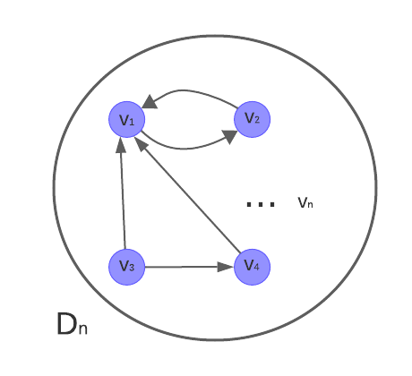
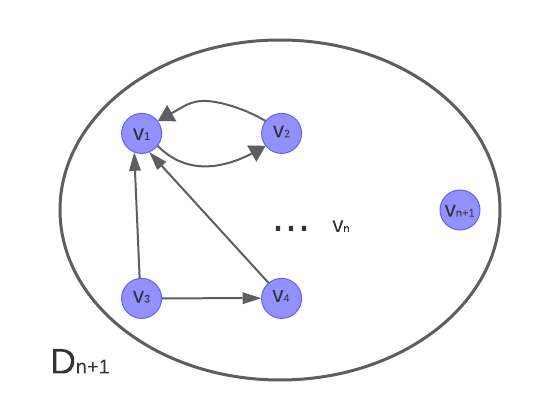
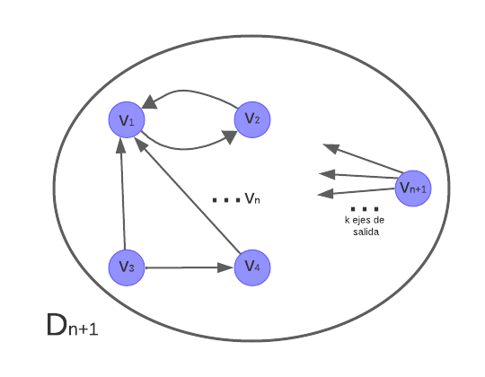

# Práctica 2: Introducción a la teoría algorítmica de grafos

## Demostración de propiedades simples sobre grafos

### Ejercicio 1

La consigna pide demostrar:

$$ 
\sum_{i=1}^{n} d_{in}(v_i) = \sum_{i=1}^{n} d_{out}(v_i) = |E(D_{n})|
$$ 

**Caso base** n = 1

En este caso al ser 1 solo nodo, no puede tener ejes. Entonces:

$$ 
\sum_{i=1}^{1} d_{in}(v_i) = 0 \wedge \sum_{i=1}^{1} d_{out}(v_i) = 0 \wedge |E(D_{1})| = 0
$$ 

Todo da cero y está bien, se cumple.

**Hipótesis inductiva** (es la misma consigna):

$$ 
\sum_{i=1}^{n} d_{in}(v_i) = \sum_{i=1}^{n} d_{out}(v_i) = |E(D_{n})|
$$

**Paso inductivo:**
Quiero ver que se cumpla para n+1 nodos.

Supongamos que nuestro digrafo Dn es el siguiente:

(los ejes son de referencia, en realidad pueden estar conectados de cualquier manera posible)

Entonces, en el caso de Dn+1 **progongo observar dos casos distintos**. El primero sería agregar un nuevo nodo (vn+1) pero que sea aislado:

Entonces tenemos lo siguiente:

$$ 
\sum_{i=1}^{n+1} d_{in}(v_i) = \sum_{i=1}^{n+1} d_{out}(v_i) = |E(D)_{n+1}|
$$ 

Que se puede reescribir de la siguiente manera:

$$ 
\sum_{i=1}^{n} d_{in}(v_i) + d_{in}(v_{n+1}) = \sum_{i=1}^{n} d_{out}(v_i) + d_{out}(v_{n+1}) = |E(D_{n+1})|
$$

Como sabemos que vn+1 es aislado sabemos din(vn+1) y dout(vn+1) son igual a 0. Además, por la misma razón,
tanto las sumatorias del paso n como |E(D)| son iguales a las de la H.I. entonces se cumple el paso n+1.

En el otro caso el nuevo nodo vn+1 tiene k ejes de salida y k' ejes de entrada, como se intenta ilustrar en la siguiente imagen:

Entonces aquí sabemos lo siguiente:

$$ 
d_{in}(v_{n+1}) = k' \wedge d_{out}(v_{n+1}) = k
$$

Sabemos que cada uno de esos k ejes de salida sumarán 1 a los de entrada de cada nodo vi y que cada uno de los de entrada sumaran uno a los de salida de los mismos vi. Además
cada una de estas conexiones debe ser agregada al vector E(D). Entonces recordemos el caso de n+1:

$$ 
\sum_{i=1}^{n+1} d_{in}(v_i) = \sum_{i=1}^{n+1} d_{out}(v_i) = |E(D_{n+1})|
$$ 

Y por lo dicho anteriormente podemos reescribirlo de la siguiente manera:

$$ 
\sum_{i=1}^{n} d_{in}(v_i) + k + k' = \sum_{i=1}^{n} d_{out}(v_i) + k + k' = |E(D_{n})| + k + k' = |E(D_{n+1})|
$$ 

Por H.I. inductiva sabemos que esa igualdad se cumple, entonces al agregar k y k' a cada igualdad se seguirá cumpliendo, por ende también se cumple el paso n+1.

### Ejercicio 2

Supongamos que tenemos un vector W que representa los grados de cada uno de los vi, con 1 <= i <= n, que pertenecen a G de la siguiente manera:

$$ 
W = [d(v_1),d(v_2),...,d(v_n)]
$$ 

Queremos demostrar que:

$$
\neg\exists \text{ i, j donde } i \neq j  \text{ tal que } d(v_i) = d(v_j)
$$

Para ello vamos ir por el absurdo pensando lo contrario, es decir, que todos son distintos y no puede pasar lo que se quiere demostrar.

Entonces, sabemos que el grado máximo que puede tener algún nodo n de G es n-1, lo que se consigue cuando un nodo está conectado con todos los demás. Si queremos conseguir un vector W con los valores ordenados, la única combinación posible de que todos sean distintos, tomando en cuenta que n-1 es el su valor más alto es la siguiente:

$$ 
W = [0, 1, 2, ..., n-1]
$$ 

Lo que es un absurdo, puesto que según esto existe algún nodo cuyo grado es 0 y habíamos dicho que para que uno tenga grado n-1 este debe estar conectado con todos, es decir no puede haber uno con grado 0.

