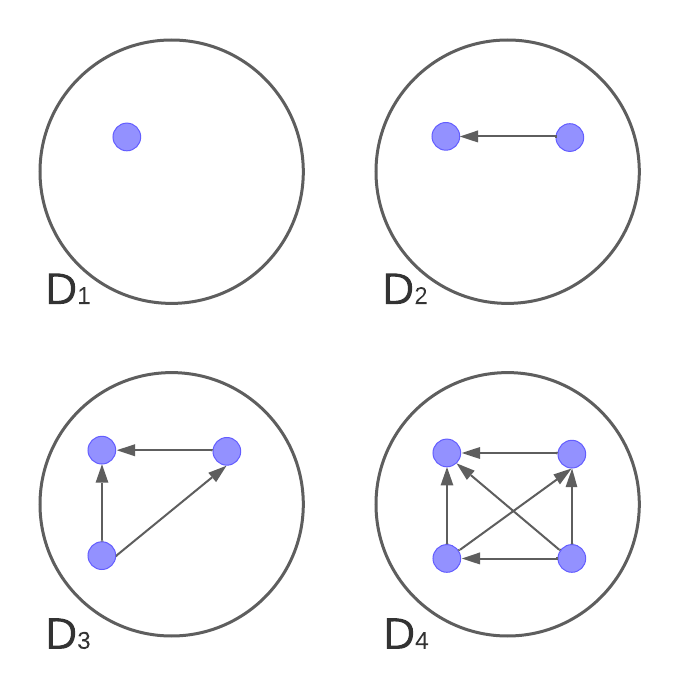

# Práctica 2: Introducción a la teoría algorítmica de grafos

## Demostración de propiedades simples sobre grafos

### Ejercicio 1

La consigna pide demostrar:

$$ 
\sum_{i=1}^{n} d_{in}(v_i) = \sum_{i=1}^{n} d_{out}(v_i) = |E(D_{n})|
$$ 

**Caso base** n = 1

En este caso al ser 1 solo nodo, no puede tener ejes. Entonces:

$$ 
\sum_{i=1}^{1} d_{in}(v_i) = 0 \wedge \sum_{i=1}^{1} d_{out}(v_i) = 0 \wedge |E(D_{1})| = 0
$$ 

Todo da cero y está bien, se cumple.

**Hipótesis inductiva** (es la misma consigna):

$$ 
\sum_{i=1}^{n} d_{in}(v_i) = \sum_{i=1}^{n} d_{out}(v_i) = |E(D_{n})|
$$

**Paso inductivo:**
Quiero ver que se cumpla para n+1 nodos.

Supongamos que nuestro digrafo Dn es el siguiente:

(los ejes son de referencia, en realidad pueden estar conectados de cualquier manera posible)

Entonces, en el caso de Dn+1 **progongo observar dos casos distintos**. El primero sería agregar un nuevo nodo (vn+1) pero que sea aislado:

Entonces tenemos lo siguiente:

$$ 
\sum_{i=1}^{n+1} d_{in}(v_i) = \sum_{i=1}^{n+1} d_{out}(v_i) = |E(D)_{n+1}|
$$ 

Que se puede reescribir de la siguiente manera:

$$ 
\sum_{i=1}^{n} d_{in}(v_i) + d_{in}(v_{n+1}) = \sum_{i=1}^{n} d_{out}(v_i) + d_{out}(v_{n+1}) = |E(D_{n+1})|
$$

Como sabemos que vn+1 es aislado sabemos din(vn+1) y dout(vn+1) son igual a 0. Además, por la misma razón,
tanto las sumatorias del paso n como |E(D)| son iguales a las de la H.I. entonces se cumple el paso n+1.

En el otro caso el nuevo nodo vn+1 tiene k ejes de salida y k' ejes de entrada, como se intenta ilustrar en la siguiente imagen:

Entonces aquí sabemos lo siguiente:

$$ 
d_{in}(v_{n+1}) = k' \wedge d_{out}(v_{n+1}) = k
$$

Sabemos que cada uno de esos k ejes de salida sumarán 1 a los de entrada de cada nodo vi y que cada uno de los de entrada sumaran uno a los de salida de los mismos vi. Además
cada una de estas conexiones debe ser agregada al vector E(D). Entonces recordemos el caso de n+1:

$$ 
\sum_{i=1}^{n+1} d_{in}(v_i) = \sum_{i=1}^{n+1} d_{out}(v_i) = |E(D_{n+1})|
$$ 

Y por lo dicho anteriormente podemos reescribirlo de la siguiente manera:

$$ 
\sum_{i=1}^{n} d_{in}(v_i) + k + k' = \sum_{i=1}^{n} d_{out}(v_i) + k + k' = |E(D_{n})| + k + k' = |E(D_{n+1})|
$$ 

Por H.I. inductiva sabemos que esa igualdad se cumple, entonces al agregar k y k' a cada igualdad se seguirá cumpliendo, por ende también se cumple el paso n+1.

### Ejercicio 2

Supongamos que tenemos un vector W que representa los grados de cada uno de los vi, con 1 <= i <= n, que pertenecen a G de la siguiente manera:

$$ 
W = [d(v_1),d(v_2),...,d(v_n)]
$$ 

Queremos demostrar que:

$$
\neg\exists \text{ i, j donde } i \neq j  \text{ tal que } d(v_i) = d(v_j)
$$

Para ello vamos ir por el absurdo pensando lo contrario, es decir, que todos son distintos y no puede pasar lo que se quiere demostrar.

Entonces, sabemos que el grado máximo que puede tener algún nodo n de G es n-1, lo que se consigue cuando un nodo está conectado con todos los demás. Si queremos conseguir un vector W con los valores ordenados, la única combinación posible de que todos sean distintos, tomando en cuenta que n-1 es el su valor más alto es la siguiente:

$$ 
W = [0, 1, 2, ..., n-1]
$$ 

Lo que es un absurdo, puesto que según esto existe algún nodo cuyo grado es 0 y habíamos dicho que para que uno tenga grado n-1 este debe estar conectado con todos, es decir no puede haber uno con grado 0.

### Ejercicio 3

Sea Dn un grafo orientado:

$$
D_n = [v_1,v_2,...,v_n]
$$

quiero probar que existe un único Dn que cumple:

$$
\forall \text{ i, j  donde } i \neq j \wedge d_{out}(v_i) \neq d_{out}(v_j) \wedge (\neg \exists i,j \text{ tal que } (i,j) \in E(D_n) \wedge (j,i) \in E(D_n))
$$

La idea para ir armando un grafo orientado de estas características es empezar por un nodo que no tenga ninguna conexión, luego el siguiente se conecta a ese y cada vez que agregas un nodo se conecta a todos los que ya tenías. La siguiente imagen representa esta idea:

De esta manera cada dout(vi) es igual al anterior +1. Por ejemplo, si tenemos el siguiente vector Wout:

$$ 
W_{out} = [d_{out}(v_1),d_{out}(v_2),...,d_{out}(v_n)]
$$

Y si empezamos a construir nuestro grafo de la manera en que se muestra en la imagen, quedaría de la siguiente manera:

$$ 
W_{out} = [0,1,2,...,n-1]
$$

De esta manera tendríamos un grafo Dn orientado que cumple lo que pide la consigna y es único ya que es la única combinación de grados posibles con tal de que todos sean distintos (recordar que n-1 es el grado máximo, como en el ejercicio anterior).

### Ejercicio 4

**a)** 
H.I. : Sea Gk un grafo de k nodos donde m > (n-1)(n-2)/2 -> Gk es conexo

Para los casos k=0 o k=1 no se puede hablar de que sean conexos ya que ni siquiera tienen aristas.

Caso base k=2 y m=1:

1 > (2-1)(2-2)/2 -> 1 > 0 -> está bien y cumple.

Paso inductivo:

Supongamos que tenemos un grafo Gk+1 con k+1 nodos y m > k(k-1)/2 entonces quiero ver si es conexo. Vamos a ponernos en el peor caso, es decir, que m es apenas mayor a esa desigualdad:

$$ 
m = \frac{k(k-1)}{2} + 1
$$

Ahora me gustaría quitarle un nodo para tener el grafo Gk de la H.I. pero al hacerlo debo también quitarle sus ejes. Llamemos m' a los ejes de Gk quedaría entonces:

$$ 
m' = \frac{k(k-1)}{2} + 1 - d_{G_{k+1}}(v_{k+1})
$$

Ahora, la idea es la siguiente: si al restar el nodo para obtener el grafo Gk este sigue siendo conexo, entonces Gk+1 también lo es. Supongamos el peor caso, que sería buscar el máximo valor que puede tener dGk+1(vk+1). Como ya vimos antes, el máximo valor posible sería k, donde este nodo estaría conectado con todos los demás, pero si eso sucede quiere decir que es conexo ya que gracias a ese nodo tienes a todos conectados entre sí. Entonces el peor valor sería restarle k-1, es decir:

$$ 
d_{G_{k+1}}(v_{k+1}) = k-1 \implies m' = \frac{k(k-1)}{2} + 1 - (k - 1)
$$

Nos gustaría ver que m' cumple H.I. así que resolvemos la siguiente desigualdad:

$$ 
\frac{k(k-1)}{2} + 1 - (k - 1) > \frac{(k-1)(k-2)}{2} 
$$

multiplico todo por 2:

$$ 
k(k - 1) + 2 - 2k + 2 > (k - 1)(k - 2) 
$$

resuelvo las multiplicaciones

$$
k^2 - 3k + 4 > k^2 -3k + 2 \implies 4 > 2
$$

Entonces la desigualdad se cumple, m' > (k-1)(k-2)/2 -> por H.I. Gk es conexo, entonces Gk+1 también.

