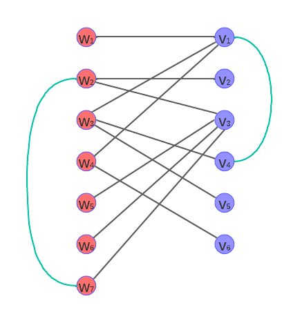

# Práctica 3: Recorridos y Árboles

## Recorridos en profundidad

### Ejercicio 1

**a)**


Como se observa en la imagen, el camino entre dos nodos distintos que pertenezcan ambos a V o ambos a W siempre tendrán una cantidad impar de nodos y al juntarlos con una arista *backedge* esto se sigue manteniendo.

**b)**



Como se observa en la imagen, siempre y cuando los ejes *backedge* no conecten a dos nodos de V o dos nodos de W, se formará una bipartición entre V y W.

**c)** Aquí la idea es usar DFS pero con un vector de distancias, donde se guarde la distancia de cada nodo hasta la raíz del árbol. Para saber si es bipartito, se inicia una variable booleana en 'true' y en caso de encontrar un *backedge*
fijarse si la distancia de ambos nodos es par o ambos impar entonces no es bipartito (significa que dos nodos v o w están conectados entre sí). Entonces en caso de que ocurra lo anterior armo el ciclo de longitud impar. Una posible
implementación sería la siguiente:

Aquí solo hice un código que se queda con el primer ciclo que encuentra, siempre y cuando para todo v<sub>i</sub>, d<sub>out</sub>(v<sub>i</sub>) > 0.

```cpp
vector<vector<int>> aristas;
vector<int> padre;
vector<int> distancia;
vector<int> ciclo;

bool esBipartito = true;

int comienzo_ciclo = -1;
int fin_ciclo = -1;


void armarCiclo(){
    if (comienzo_ciclo >= 0) {
        int v = comienzo_ciclo;
        ciclo.push_back(v);
        while (v != fin_ciclo) {
            v = padre[v];
            ciclo.push_back(v);
        }
    }
}

void dfs(int v, int distRaiz) {
    distancia[v] = distRaiz; // guardo distancia hasta la raíz

    for (int u: aristas[v]) {
        if (padre[u] == -1) {
            padre[u] = v;
            dfs(u, distRaiz+1);
        } else if (padre[v] != u) {
            if(distancia[v]%2 == distancia[u]%2){ // si las distancias son ambas pares o impares entonces no es bipartito
                comienzo_ciclo = v;
                fin_ciclo = u;
                armarCiclo();
                esBipartito = false;
            }
        }
    }
}
```

**d)**

### Ejercicio 8

La idea es usar bfs para recorrer los distintos caminos y cortar cuando encuentres un valor que sea igual a w, retornando la distancia, ya que esta representa la cantidad de movimientos que se hicieron desde la casilla inicial. De todas maneras, la parte complicada es pensar cómo representarás el grafo, que en este caso se hizo con una lista de adyacencias para cada (x<sub>i</sub>,y<sub>i</sub>,v<sub>i</sub>). Como cada casilla tiene 4 direcciones a las que puede ir la complejidad de armar tu lista es de O(4\*m\*n\*k) = O(m\*n\*k). Una implementación posible en c++ sería la siguiente:


```cpp
struct tripla {
    int x;
    int y;
    int z;
};

vector<vector<int>> matriz = {{1,3,6},{6,7,4},{4,9,3}};
int posInicial = matriz[0][0];

int m=3;
int n=3;
int k=10;

int w=0;

vector<vector<vector<vector<tripla>>>> grafo(m, vector<vector<vector<tripla>>>(n, vector<vector<tripla>>(k)));

int dx[] = {-1, 1, 0, 0}; // son las cuatro direcciones a las que se puede ir
int dy[] = {0, 0, -1, 1};

void listaAdyacencias() { // O(m*n*k)
    int valor_actual = posInicial;
    for (int x = 0; x < m; ++x) {
        for (int y = 0; y < n; ++y) {
            for (int v = 0; v < k; ++v) {
                for (int i = 0; i < 4; ++i) {
                    int nuevoX = x + dx[i];
                    int nuevoY = y + dy[i];
                    if (nuevoX >= 0 && nuevoX < m && nuevoY >= 0 && nuevoY < n) {
                        valor_actual = (v+matriz[nuevoX][nuevoY]) % k;
                        grafo[x][y][v].push_back({nuevoX, nuevoY, valor_actual});
                    }
                }
            }
        }
    }
}

vector<vector<vector<bool>>> visitado(m, vector<vector<bool>>(n, vector<bool>(k, false)));
vector<vector<vector<int>>> distancia(m,vector<vector<int>>(n,vector<int>(k,-1)));

int bfs(tripla s) {
    visitado[s.x][s.y][s.z] = true;
    distancia[s.x][s.y][s.z] = 0;
    queue<pair<tripla,int>> q;
    q.push({s,0});
    while (!q.empty()) {
        pair<tripla,int> v = q.front(); q.pop();
        for (auto u : grafo[v.first.x][v.first.y][v.first.z]) {
            if (!visitado[u.x][u.y][u.z]) {
                visitado[u.x][u.y][u.z] = true;
                distancia[u.x][u.y][u.z] = distancia[v.first.x][v.first.y][v.first.z] + 1;
                int dist = distancia[u.x][u.y][u.z];
                q.push({u,dist});
                if(u.z==w) return dist;
            }
        }
    }
    return -1; // no llega nunca a w
}


int main(){

    listaAdyacencias();
    int res = bfs({0,0,1});

    cout << res << endl;

    return 0;
}
```
